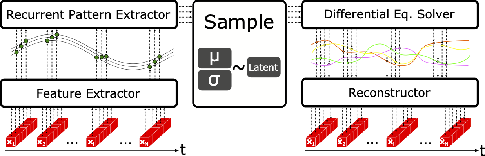
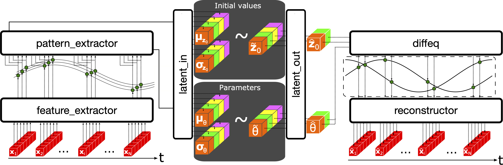

# LatentDiffEq.jl 

[](https://travis-ci.com/github/gabrevaya/LatentDiffEq.jl)

Latent Differential Equation models is a powerful class of models that brings great promise to the field of time series processing. [Flux.jl](https://github.com/FluxML/Flux.jl) and the [SciML](https://github.com/SciML) provide all the tools to build these latent DE models. However, the process of setting up those models can be a time-consuming endeavor with a quite steep learning curve for people without a background in machine learning. LatentDiffEq.jl aims to provide a framework that makes latent differential equation models readily accessible to people that needs it most. This is done by providing pre-programmed established models in Latent Differential Equations while offering a high level of flexibility for new user-defined models.



This package is still in an early (but functionnal) stage of it's developpement, any help in finding bugs or improvement would be greatly appreciated. Please get in touch if, like us, you share a great interest in bringing this exiting field of research to a wider audience!

## Getting Started
### Installation

```julia
julia> ]
pkg> add https://github.com/gabrevaya/LatentDiffEq.jl.git
```

### Tutorial (Coming soon!)
Checkout the Tutorial to get familiar with the base functionalities of this package. If you wish to build your own models, this is also convered in the Tutorial. You can also refer to the following chart detailing the names of the functions associated with the different parts of the package.



## References

Chen, Ricky TQ, et al. "Neural ordinary differential equations." arXiv preprint arXiv:1806.07366 (2018).
Linial, O., Eytan, D., & Shalit, U. (2020). Generative ODE Modeling with Known Unknowns. arXiv preprint [arXiv:2003.10775](https://arxiv.org/abs/2003.10775).
